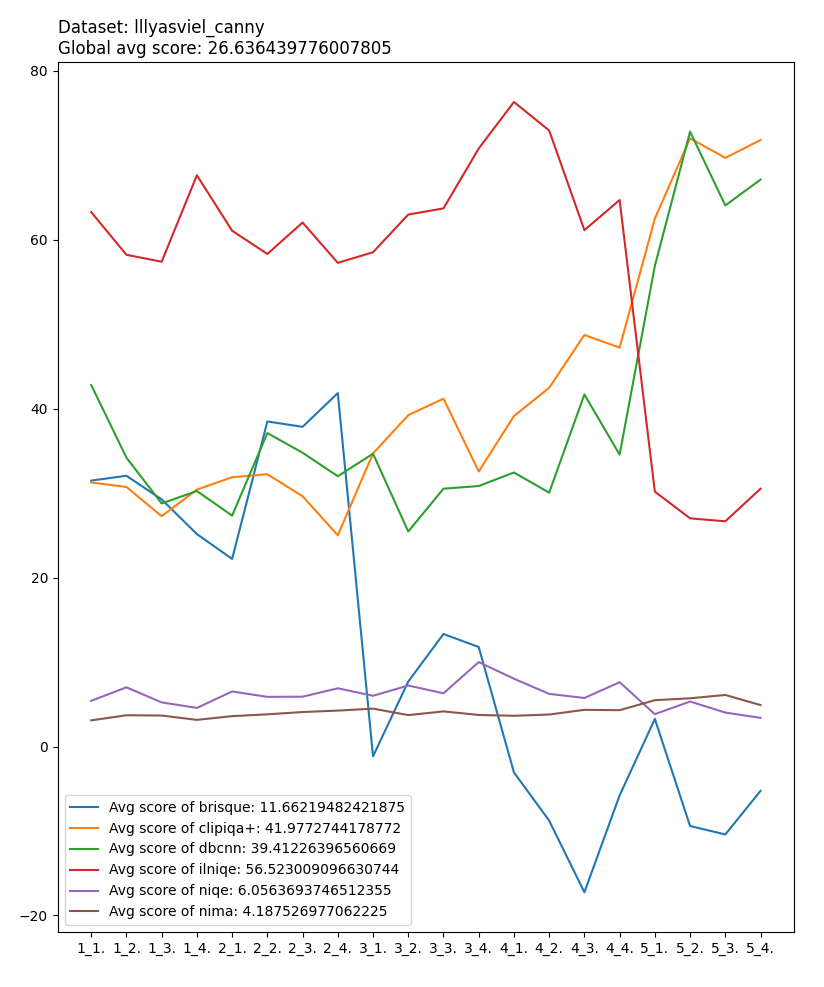
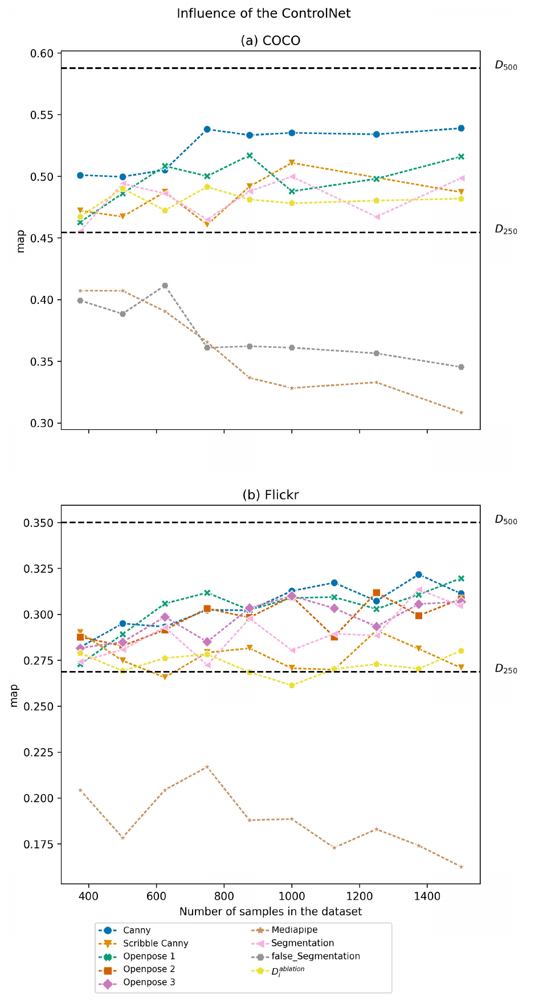

# Results

Quantitative and qualitative results demonstrating the effectiveness of CIA for synthetic data augmentation.

## Pipeline Overview

The CIA framework generates high-fidelity synthetic images by extracting structural conditions from real images and using them to guide Stable Diffusion + ControlNet generation.

## Quantitative Results

### COCO People Detection

Synthetic augmentation improves object detection on COCO people across multiple sampling strategies.

### Training Loss

Models trained with CIA-augmented data converge effectively.

### Flickr30K

Consistent improvements observed on the Flickr30K entity detection task.

### Quality Assessment

Synthetic images generated by CIA maintain high perceptual quality as measured by image quality assessment metrics.

## Sampling Strategies

Comparison of different synthetic image selection strategies. Filtering by PTD scores (top-k) selects the most distribution-faithful samples, improving downstream task performance.